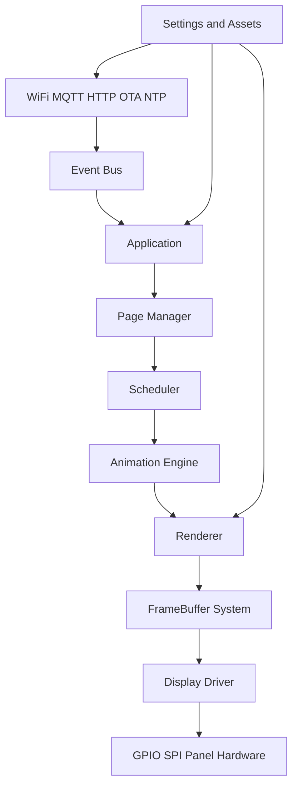
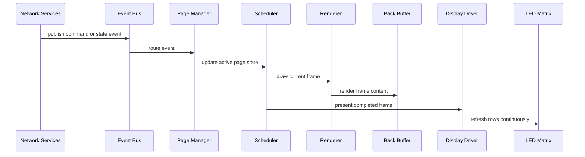
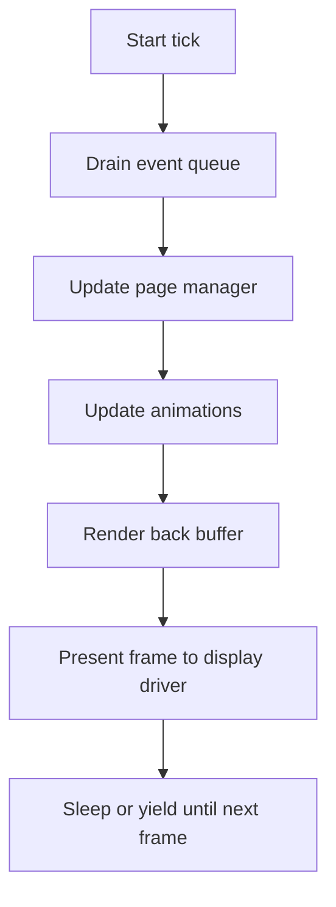
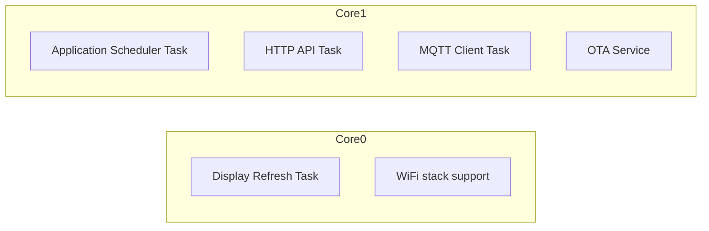

# ESP32 Matrix Display 2026 Technical Reference

## Purpose

This document is the primary technical reference for the new `matrix-display-2026` implementation. It consolidates:

- the target product requirements from `SPECS.alpha.md`
- the recovered behavior of the earlier `gfx6.1` prototype
- the architectural decisions required to build a maintainable production firmware

It is intended to serve as the baseline development document for implementation, review, testing, and future extension.

## Scope

This reference defines:

- hardware assumptions and electrical interface expectations
- firmware architecture and module boundaries
- rendering and refresh model
- grayscale strategy
- page, animation, scheduler, and event design
- networking, storage, OTA, and configuration behavior
- performance targets and validation requirements
- recommended folder structure and public interfaces

This document does not attempt to freeze every class name or every internal implementation detail, but it does define the required contracts and behavior that the implementation must satisfy.

## Source Basis

This reference is based on the following project documents:

- `HARDWARE.md`
- `FIRMWARE-RECOVERY.md`
- `SPECS.alpha.md`

## Normative Language

The terms below are used intentionally:

- MUST: mandatory requirement
- SHOULD: strong recommendation unless a documented reason exists not to do it
- MAY: optional implementation detail or extension

## Executive Summary

The firmware MUST be a modular ESP32 application that drives a recycled monochrome LED matrix using a custom scan driver while keeping refresh isolated from high-level application logic.

The verified baseline hardware from the old prototype is `80 x 16`, monochrome, row-multiplexed, and shift-register driven. The new firmware MUST preserve compatibility with that verified hardware baseline while being designed so future hardware variants such as `120 x 16` can be introduced with configuration and driver adaptation rather than architectural rewrites.

The system MUST support:

- flicker-free refresh
- 4-bit grayscale using BAM
- double-buffered rendering
- built-in self-test and demo modes for core display features
- pages and animations as first-class concepts
- Wi-Fi, MQTT, HTTP, OTA, NTP, persistent settings, and logging
- non-blocking networking that never compromises display refresh

## Verified Hardware Baseline

### Confirmed Baseline Geometry

The recovered prototype proves the currently known hardware contract is:

- width: `80` pixels
- height: `16` pixels
- color mode: monochrome electrical output
- scan model: row multiplexing
- column drive: serial shift register chain

### Specification Mismatch Resolution

`SPECS.alpha.md` starts by saying `120 x 16`, but the detailed hardware section and the recovered prototype both describe `80 x 16`.

The implementation baseline for phase 1 MUST therefore be:

- primary supported panel: `80 x 16`
- architecture requirement: panel geometry MUST be configurable so `120 x 16` and other future variants can be added later

The geometry MUST NOT be hardcoded across the entire codebase. It MUST be centralized in display configuration.

### Verified ESP32 Wiring

Recovered from the prototype:

| Signal | ESP32 Pin | Role |
| --- | ---: | --- |
| `DATA_PIN` | `23` | SPI MOSI |
| `CLOCK_PIN` | `18` | SPI SCK |
| `LATCH_PIN` | `5` | column latch / strobe |
| `DATA0_PIN` | `13` | row select bit 0 |
| `DATA1_PIN` | `12` | row select bit 1 |
| `DATA2_PIN` | `14` | row select bit 2 |
| `ROW_PIN` | `27` | row select bit 3 |
| `ENABLE_PIN` | `26` | active-low global output enable |

### Verified Electrical Behavior

The driver contract recovered from `gfx6.1` is:

- SPI transfers one full row payload at a time
- row addressing uses a 4-bit binary row select bus for `16` rows
- latch commits shifted column state to output drivers
- enable is active low
- brightness in the old system is global row duty-cycle modulation

### Hardware Abstraction Requirements

The new implementation MUST isolate hardware specifics in a display subsystem that owns:

- GPIO setup
- SPI configuration
- row select encoding
- latch timing
- output enable timing
- BAM subframe timing
- panel geometry and scan topology

No page, animation, renderer, HTTP, MQTT, or business logic module MAY directly manipulate GPIO or SPI.

## Target Functional Requirements

The new implementation MUST support all of the following feature groups.

### Display Features

- `80 x 16` verified baseline support
- configurable future panel geometry
- monochrome physical panel output
- logical 4-bit grayscale rendering using BAM
- text rendering with custom fonts
- multiline text rendering
- static and animated bitmap display
- sprite rendering
- multiple page types
- global brightness control
- power control
- display preview API support for future web UI

### Bring-Up And Demo Features

The initial implementation MUST include built-in demo modes so the platform can be validated without MQTT, HTTP, or external assets.

At minimum, phase 1 MUST include demos for:

- full-screen fill on and off
- grayscale ramp or staircase across all 16 logical levels
- primitive drawing: pixels, lines, rectangles, filled rectangles, and circles if implemented
- text rendering with at least one font
- multiline text rendering
- clock rendering
- bitmap or logo rendering
- animation and transition behavior
- brightness and power behavior

These demo modes SHOULD be accessible through a local demo page sequence, a default boot mode, and optionally HTTP or MQTT commands.

### Networking Features

- Wi-Fi station mode
- DHCP and static IP modes
- automatic reconnect
- MQTT connectivity and reconnection
- HTTP API
- OTA firmware updates
- NTP time synchronization
- mDNS

### System Features

- persistent settings in NVS
- logging with levels
- event-driven decoupling between networking and display/application logic
- predictable task partitioning with FreeRTOS
- preallocated rendering memory

## Non-Functional Requirements

The system MUST satisfy these engineering properties:

- refresh path MUST be independent from networking latency
- rendering SHOULD target `60 FPS`, with `30 FPS` as the minimum normal operating target
- display output MUST remain visually stable during Wi-Fi reconnects, OTA idle periods, and HTTP/MQTT traffic bursts
- implementation MUST actively prevent tearing and common scan artifacts such as flicker, ghosting, shimmer, row bleeding, partial-frame updates, and unstable brightness
- runtime memory allocation during steady-state rendering SHOULD be avoided
- public module boundaries MUST be documented and testable
- future features MUST be addable as modules, not by entangling existing modules

## System Architecture

### Architectural Principle

The firmware MUST behave like a small embedded platform, not a monolithic sketch. Display refresh is low-level infrastructure; pages and animations are application-level concepts layered on top.

### Layered Stack



### Runtime Data Flow



### Module Responsibilities

| Module | Owns | Must Not Own |
| --- | --- | --- |
| `DisplayDriver` | scanout, timing, GPIO, SPI, BAM | text, fonts, MQTT, pages |
| `FrameBuffer` | pixel storage and buffer swaps | hardware access |
| `Renderer` | drawing primitives, text, sprites, composition | direct refresh timing |
| `AnimationEngine` | transitions and per-frame effects | Wi-Fi, SPI |
| `Page` implementations | domain content and state | hardware access |
| `Scheduler` | update cadence and frame orchestration | hardware pin handling |
| `EventBus` | typed decoupled events | business logic decisions |
| `WifiManager` | connectivity lifecycle | display mutation |
| `MqttClient` | MQTT transport | display mutation |
| `HttpServer` | REST API transport | display mutation |
| `Settings` | persisted config | rendering logic |
| `ClockService` | time abstraction | page policy |
| `AssetManager` | font and asset loading | scan timing |

## Core Technical Design

### Display Driver

The display driver is the only subsystem that talks to the panel electrically.

Responsibilities:

- initialize SPI and GPIO
- map logical rows to row select pins
- encode subframes for BAM
- continuously refresh the panel
- enforce global brightness and power state
- present a completed framebuffer snapshot for scanout

It MUST expose a narrow API. A recommended interface is:

```cpp
class DisplayDriver {
public:
    bool begin(const DisplayConfig& config);
    void setPower(bool enabled);
    void setBrightness(uint8_t brightness);      // 0..255 logical brightness ceiling
    void present(const FrameBuffer4& frame);     // enqueue or publish scanout frame
    void refresh();                              // used only if refresh is cooperative
    DisplayStats getStats() const;
};
```

#### Driver Model

The preferred model is a dedicated refresh task pinned to one core. That task continuously scans rows and BAM bit planes independent of the application frame rate.

The driver SHOULD support:

- atomic pointer swap to the current scanout frame
- a blank frame fallback when power is off
- refresh statistics such as scan rate, dropped presents, and last frame time

#### Visual Integrity Requirements

The display driver and presentation path MUST be designed to prevent visible defects that are common in multiplexed LED matrices.

At minimum, the implementation MUST guard against:

- tearing caused by publishing a frame while it is being scanned
- ghosting caused by incorrect output-enable and latch sequencing
- shimmer or brightness pumping caused by unstable BAM dwell timing
- row bleeding caused by changing row address or column state while output is active
- partial-frame display caused by exposing incomplete plane or row data
- transient corruption during page transitions, brightness changes, or network-triggered updates

Recommended protections:

- blank output before changing row address or latch state
- publish new frames only at a defined frame boundary or generation boundary
- build scan-ready BAM data before it becomes visible
- keep row and plane timing deterministic
- treat power-state and brightness changes as synchronized presentation events rather than immediate asynchronous GPIO changes

#### Geometry Model

The driver MUST not assume `80 x 16` internally without configuration. Recommended configuration:

```cpp
struct DisplayConfig {
    uint16_t width;
    uint16_t height;
    uint8_t bitDepth;
    uint8_t rowAddressBits;
    uint32_t spiHz;
    uint8_t pinMosi;
    uint8_t pinClk;
    uint8_t pinLatch;
    uint8_t pinEnable;
    uint8_t pinRow[4];
    bool enableActiveLow;
};
```

### FrameBuffer System

The framebuffer MUST be hardware-independent and MUST represent the logical display state.

Phase 1 framebuffer requirements:

- geometry: configurable, initially `80 x 16`
- logical pixel depth: `4` bits per pixel
- two buffers minimum: front and back
- fast clear, fill, copy, and swap
- deterministic memory layout

Recommended storage:

- packed `4 bpp` buffer in RAM
- one nibble per pixel
- optional scratch line or plane buffers owned by the driver

Approximate memory cost for `80 x 16`:

- one `4 bpp` frame = `80 * 16 * 4 / 8 = 640 bytes`
- double buffer = `1280 bytes`
- BAM scratch and row staging buffers add modest overhead

Recommended API:

```cpp
class FrameBuffer4 {
public:
    FrameBuffer4(uint16_t width, uint16_t height, uint8_t* storage);
    void clear();
    void fill(uint8_t value);
    void setPixel(uint16_t x, uint16_t y, uint8_t gray);
    uint8_t getPixel(uint16_t x, uint16_t y) const;
    void copyFrom(const FrameBuffer4& other);
    void swap(FrameBuffer4& other);
    uint16_t width() const;
    uint16_t height() const;
};
```

### Renderer

The renderer is the high-level drawing API for pages and animations.

It MUST provide:

- pixel drawing
- lines
- rectangles
- filled rectangles
- circles where practical
- bitmaps
- sprite composition
- text drawing
- clipping
- optional alignment helpers

The renderer MUST draw only into the back buffer.

The renderer MUST NOT:

- drive GPIO
- know refresh timing
- manage network state

#### Text And Multiline Text Requirements

Text support in phase 1 MUST include:

- explicit newline handling using `\n`
- multi-line layout within a bounded region
- left alignment at minimum
- clipping against the framebuffer bounds
- configurable line spacing

The preferred phase 1 text behavior is:

- newline characters always start a new line
- lines render top-to-bottom
- glyph rendering outside the target bounds is clipped
- vertical overflow is clipped, not wrapped infinitely

Word wrap MAY be added in phase 1, but newline-driven multiline layout is mandatory.

Recommended API extensions:

```cpp
enum class TextWrapMode {
  None,
  Character,
  Word
};

struct TextLayoutOptions {
  int16_t maxWidth;
  int16_t maxHeight;
  int8_t lineSpacing;
  TextWrapMode wrapMode;
  HorizontalAlign align;
};
```

Recommended renderer API:

```cpp
class Renderer {
public:
    void beginFrame(FrameBuffer4& target);
    void clear(uint8_t gray = 0);
    void drawPixel(int16_t x, int16_t y, uint8_t gray);
    void drawLine(int16_t x0, int16_t y0, int16_t x1, int16_t y1, uint8_t gray);
    void drawRect(int16_t x, int16_t y, int16_t w, int16_t h, uint8_t gray);
    void fillRect(int16_t x, int16_t y, int16_t w, int16_t h, uint8_t gray);
    void drawBitmap(int16_t x, int16_t y, const Bitmap& bitmap);
    void drawSprite(int16_t x, int16_t y, const Sprite& sprite);
    void drawText(int16_t x, int16_t y, StringView text, const FontAsset& font, uint8_t gray);
    void drawTextBox(int16_t x, int16_t y, const TextLayoutOptions& options, StringView text, const FontAsset& font, uint8_t gray);
};
```

### Grayscale And BAM

The spec requires `4-bit BAM`. The implementation MUST therefore support `16` logical brightness levels per pixel.

#### Required Behavior

- logical pixel values range from `0` to `15`
- driver converts logical pixel values into BAM subframes
- BAM timing weights SHOULD be `1, 2, 4, 8`
- total subframe period must be short enough to avoid visible flicker

#### Recommended BAM Scan Model

For each application frame:

1. extract 4 bit planes from the presented front buffer
2. for each row
3. for each BAM plane
4. shift row bits for that plane
5. enable row for the plane-weighted dwell time

Example BAM weights:

| Plane | Bit | Weight |
| --- | ---: | ---: |
| P0 | 0 | 1 |
| P1 | 1 | 2 |
| P2 | 2 | 4 |
| P3 | 3 | 8 |

The base time quantum MUST be tuned empirically to avoid ghosting, brightness instability, or visible flicker.

#### Brightness Policy

Global brightness SHOULD scale the BAM dwell budget rather than modifying pixels in software every frame. That keeps page rendering independent from hardware brightness policy.

### Font System

The new firmware SHOULD reuse Adafruit GFX font concepts where beneficial but MUST not couple page rendering directly to `GFXcanvas1` like the old prototype.

Required font capabilities:

- support at least one built-in font at boot
- support loading custom fonts as assets
- support glyph metadata: offset, width, height, xAdvance, xOffset, yOffset
- support multiple fonts selected by configuration or page

Recommended asset representation:

```cpp
struct GlyphInfo {
    uint32_t bitmapOffset;
    uint8_t width;
    uint8_t height;
    int8_t xAdvance;
    int8_t xOffset;
    int8_t yOffset;
};
```

Phase 1 MAY keep fonts compiled into flash if a binary asset pipeline is not ready yet, but the software architecture MUST still route font access through `AssetManager`.

UTF-8 and Unicode support are future-facing requirements. The text pipeline SHOULD be designed so UTF-8 decoding can be inserted without rewriting all renderer or page logic.

### Asset Manager

The asset manager abstracts how non-code resources are discovered and loaded.

It SHOULD provide access to:

- fonts
- icons
- logos
- sprites
- animations
- optional future image formats

Phase 1 storage backend MAY be LittleFS. Future dedicated partitions MAY be added.

Recommended responsibilities:

- asset lookup by stable identifier
- load into RAM when required
- provide immutable handles to renderer/pages
- optional simple cache for commonly used assets

### Animation Engine

The animation engine is responsible for all transitions and temporal visual effects.

Required effect categories from the spec:

- scroll left
- scroll right
- fade
- blink
- slide
- bounce
- wave
- zoom
- typewriter
- reveal
- pixel dissolve
- marquee

The implementation MAY ship with a subset initially, but the engine architecture MUST support all of them cleanly.

Recommended interface:

```cpp
class Animation {
public:
    virtual void start(const AnimationContext& ctx) = 0;
    virtual void update(uint32_t nowMs) = 0;
    virtual void apply(Renderer& renderer) = 0;
    virtual bool finished() const = 0;
    virtual ~Animation() = default;
};
```

Animations MUST render into the same back buffer pipeline as pages. They MUST NOT bypass the renderer or directly mutate hardware state.

### Page System

Everything visible on the display is a page.

Required page concept:

```cpp
class Page {
public:
    virtual void enter() = 0;
    virtual void leave() = 0;
    virtual void handleEvent(const Event& event) = 0;
    virtual void update(uint32_t nowMs) = 0;
    virtual void draw(Renderer& renderer) = 0;
    virtual ~Page() = default;
};
```

Required phase 1 page types:

- `ClockPage`
- `TextPage`
- `ImagePage`
- `AnimationPage`
- `LogoPage`
- `DiagnosticsPage`
- `DemoPage`

Future page classes MAY include:

- sensor dashboards
- weather
- RSS
- Home Assistant panels
- scripting-backed pages

Pages MUST be hardware-agnostic. Their job is to own display content and state transitions, not display scan details.

### Demo Mode Architecture

The initial implementation MUST treat demos as first-class validation pages rather than ad hoc test code.

Recommended demo structure:

```cpp
enum class DemoSceneId {
  Fill,
  Grayscale,
  Primitives,
  Text,
  MultilineText,
  Clock,
  Bitmap,
  Sprite,
  Transition,
  Diagnostics
};
```

Recommended behavior:

- `DemoPage` cycles through scenes automatically or by command
- each scene is deterministic and visually easy to verify
- each scene exercises one subsystem clearly
- diagnostics scene displays measured frame and refresh statistics

The diagnostics-oriented demo scenes SHOULD also include visual defect checks, for example:

- fast alternating fill patterns to reveal tearing
- edge and checkerboard patterns to reveal ghosting or row bleed
- grayscale ramps to reveal BAM instability or shimmer
- scrolling text to reveal timing jitter and clipping errors

The demo suite is a product requirement for bring-up, regression testing, and field diagnostics.

### Scheduler

The scheduler coordinates application-level timing.

Responsibilities:

- process queued events
- update active page and active animation
- begin a render frame
- draw the current state into the back buffer
- swap or present to the display driver
- maintain target frame cadence

The scheduler does not perform row refresh. That remains a driver concern.

Recommended frame loop:



Target cadence:

- preferred: `60 FPS`
- minimum acceptable under normal load: `30 FPS`

### Time System

The time subsystem MUST expose a stable clock abstraction and hide NTP transport details from pages.

Required capabilities:

- NTP synchronization
- timezone support
- DST support
- monotonic timing for animations and scheduling
- wall clock time for user-visible pages

Recommended split:

- `ClockService`: current time and timezone-aware local time access
- `NtpService`: background synchronization source

Pages MUST consume time through `ClockService`, not directly through Wi-Fi or UDP code.

Clock rendering in phase 1 MUST be demonstrated locally even if NTP is unavailable, using either unsynced system time or a synthetic fallback clock source until synchronization succeeds.

## Event-Driven Integration

### Event Bus

The system MUST introduce a lightweight event bus so transport layers do not directly mutate renderer or page state.

Required event sources:

- MQTT
- HTTP API
- button or local input if added later
- time or system events
- storage/config changes

Required event sinks:

- page manager
- scheduler
- settings manager
- logging or diagnostics collectors

Recommended event model:

```cpp
enum class EventType {
    SetText,
    SetPage,
    SetEffect,
    SetBrightness,
    SetPower,
    SetConfig,
    Reboot,
    TimeSync,
    WifiStateChanged,
    MqttStateChanged
};
```

Events SHOULD carry typed payloads rather than raw strings once inside the system.

## Networking Architecture

Networking and display MUST remain decoupled.

### Wi-Fi

Required support:

- station mode
- reconnect strategy
- DHCP
- static IP configuration
- mDNS hostname advertisement

Future support MAY include captive portal onboarding.

Recommended Wi-Fi states:

- disabled
- starting
- connecting
- connected
- degraded
- reconnecting
- failed

Wi-Fi state transitions SHOULD emit events for diagnostics and APIs.

### MQTT

The spec requires MQTT with support for:

- connection
- reconnection
- authentication
- retain
- LWT
- subscriptions
- publish

MQTT MUST NOT directly manipulate page objects or the display driver. It MUST parse transport messages and publish internal events.

#### Required Topic Surface

The system MUST support these commands or their exact equivalent:

- `display/text`
- `display/page`
- `display/effect`
- `display/brightness`
- `display/power`
- `display/config`
- `display/reboot`
- `display/clock`

#### Recommended Topic Contract

| Topic | Direction | Purpose |
| --- | --- | --- |
| `display/text/set` | inbound | update text page content |
| `display/page/set` | inbound | switch active page |
| `display/effect/set` | inbound | set transition or animation policy |
| `display/brightness/set` | inbound | set global brightness |
| `display/power/set` | inbound | set power state |
| `display/config/set` | inbound | patch runtime configuration |
| `display/reboot/set` | inbound | request controlled reboot |
| `display/clock/set` | inbound | adjust time-related page options |
| `display/status` | outbound | summarized system status |
| `display/state/page` | outbound | current page state |
| `display/state/network` | outbound | Wi-Fi and MQTT status |

The original topic names from `SPECS.alpha.md` SHOULD be treated as the logical interface, while the `/set` convention above is the recommended operational contract because it separates commands from published state.

#### Example MQTT Payloads

Text command:

```json
{
  "page": "text",
  "text": "Hello world",
  "font": "sans-bold-9",
  "effect": "marquee",
  "speed": 42,
  "brightness": 180
}
```

Page switch:

```json
{
  "page": "clock",
  "transition": "fade",
  "durationMs": 500
}
```

Configuration patch:

```json
{
  "hostname": "matrix-display-2026",
  "timezone": "Europe/Paris",
  "mdns": true,
  "brightness": 192
}
```

### HTTP Server And REST API

The spec prefers `AsyncWebServer` if compatible. That SHOULD be the default choice if it does not destabilize the platform build or OTA path.

Required REST exposure:

- status
- configuration
- logs
- current page
- brightness
- time
- MQTT status
- Wi-Fi status
- memory
- future display preview

All API payloads MUST be JSON.

#### Minimum REST Endpoints

| Method | Path | Purpose |
| --- | --- | --- |
| `GET` | `/api/status` | full summarized runtime status |
| `GET` | `/api/info` | build, version, capabilities, geometry |
| `GET` | `/api/config` | current effective configuration |
| `POST` | `/api/config` | patch configuration |
| `POST` | `/api/text` | set text page content |
| `POST` | `/api/page` | change active page |
| `POST` | `/api/effect` | configure animation or transition |
| `POST` | `/api/brightness` | set global brightness |
| `POST` | `/api/power` | set display power |
| `GET` | `/api/logs` | recent log ring buffer |
| `GET` | `/api/time` | time and sync status |
| `GET` | `/api/network` | Wi-Fi and MQTT state |
| `POST` | `/api/reboot` | controlled reboot |

#### Example Status Response

```json
{
  "device": {
    "hostname": "matrix-display-2026",
    "firmwareVersion": "0.1.0",
    "build": "2026-07-10",
    "uptimeMs": 1234567
  },
  "display": {
    "width": 80,
    "height": 16,
    "bitDepth": 4,
    "brightness": 180,
    "power": true,
    "fps": 60,
    "refreshHz": 1200
  },
  "page": {
    "active": "clock",
    "transition": "fade"
  },
  "network": {
    "wifi": "connected",
    "mqtt": "connected",
    "ip": "192.168.1.42"
  },
  "time": {
    "synced": true,
    "timezone": "Europe/Paris"
  },
  "memory": {
    "heapFree": 180000,
    "largestBlock": 120000
  }
}
```

### OTA

OTA firmware update support is mandatory.

Required OTA behavior:

- authenticated update entrypoint if exposed remotely
- progress reporting through logs and status APIs
- safe reboot after successful update
- display refresh must remain controlled during OTA, with optional dimming or standby page

Future enhancement:

- asset-only updates without full firmware replacement

## Persistence And Configuration

### Settings Storage

Persistent configuration MUST use Preferences / NVS in phase 1.

Required persisted values from the spec:

- Wi-Fi credentials and mode
- MQTT broker settings
- brightness
- timezone
- current font
- animation speed
- hostname
- display options

Additional recommended persisted values:

- default page
- power-on behavior
- HTTP auth configuration if used
- log level
- static IP parameters

### Configuration Schema

Recommended internal config model:

```cpp
struct SystemConfig {
    DeviceConfig device;
    DisplayRuntimeConfig display;
    WifiConfig wifi;
    MqttConfig mqtt;
    TimeConfig time;
    ApiConfig api;
    LoggingConfig logging;
};
```

Suggested JSON representation:

```json
{
  "device": {
    "hostname": "matrix-display-2026"
  },
  "display": {
    "width": 80,
    "height": 16,
    "bitDepth": 4,
    "brightness": 180,
    "powerOn": true,
    "defaultPage": "clock",
    "animationSpeed": 42
  },
  "wifi": {
    "mode": "station",
    "dhcp": true,
    "ssid": "example",
    "staticIp": null
  },
  "mqtt": {
    "enabled": true,
    "host": "mqtt.local",
    "port": 1883,
    "username": "user",
    "clientId": "matrix-display-2026",
    "baseTopic": "display"
  },
  "time": {
    "timezone": "Europe/Paris",
    "ntpServer": "pool.ntp.org",
    "dst": "auto"
  },
  "logging": {
    "level": "INFO"
  }
}
```

Configuration changes SHOULD be validated before persistence and SHOULD emit events when applied.

## Logging And Diagnostics

The firmware MUST include a logging wrapper with these levels:

- `ERROR`
- `WARN`
- `INFO`
- `DEBUG`
- `TRACE`

Required sinks:

- Serial

Recommended sinks:

- in-memory ring buffer for HTTP retrieval
- future MQTT export

Logs SHOULD include:

- boot sequence milestones
- panel initialization result
- Wi-Fi and MQTT transitions
- NTP sync result
- page changes
- config updates
- OTA lifecycle events
- warning conditions such as dropped frames or scan underruns

Diagnostics SHOULD expose:

- firmware version and build info
- free heap and largest free block
- refresh frequency
- application FPS
- frame latency and render latency
- present-to-visible latency estimate where measurable
- jitter or variance metrics for frame time and refresh time
- dropped present count and scan underrun count
- Wi-Fi RSSI
- MQTT reconnect counters
- current page and animation
- NTP sync state

The system SHOULD support both machine-readable and visual diagnostics.

Recommended visual diagnostics modes on the LED matrix:

- a compact text overlay for FPS, latency, or refresh rate when a small font is available
- a right-edge single-column histogram or sparkline representing recent frame time, latency, dropped frames, or brightness budget
- a diagnostics page that cycles between textual stats and minimal graphical indicators

Visual diagnostics MUST be optional and MUST NOT interfere with normal page rendering unless the diagnostics mode or overlay is explicitly enabled.

## Tasking And Core Allocation

The spec requires FreeRTOS and explicitly calls out that display refresh must never block.

### Recommended Task Layout



Recommended responsibilities:

- `DisplayRefreshTask`: highest priority among application-owned tasks, owns panel scan timing
- `ApplicationTask`: page updates, animation engine, frame rendering, present operations
- `NetworkTask` or service callbacks: Wi-Fi, MQTT, HTTP event handling
- `OtaTask`: update handling when active

The exact partition MAY vary depending on library behavior, but refresh isolation is mandatory.

### Synchronization Rules

- front-buffer publication to the display driver MUST be atomic or guarded
- event queues MUST be bounded
- rendering MUST target the back buffer only
- no task other than the display driver MAY read scanout staging structures while they are being updated

## Performance And Optimization Review

The old prototype proves that the baseline panel is easy to light, but it also reveals obvious inefficiencies that the new implementation SHOULD remove.

### Main Bottlenecks In The Old Prototype

The recovered `gfx6.1` driver spends significant time in:

- busy-wait loops for per-row on-time and off-time
- `SPI.beginTransaction()` and `SPI.endTransaction()` on every row
- row-by-row `memcpy()` into a temporary row buffer before transfer
- full software sequencing of every latch and dwell interval
- a 1-bit pipeline that cannot scale cleanly to 4-bit BAM without much more CPU load

### Optimizations That Are Realistically Valuable

The following optimizations are technically plausible and SHOULD be considered part of the implementation strategy.

#### 1. Dedicated Refresh Task

Use a dedicated high-priority refresh task pinned to one core so row scan timing is isolated from application and network jitter.

Why it matters:

- removes the old sketch's `for (;;)` refresh loop from the generic Arduino `loop()` model
- makes timing ownership explicit
- reduces interference from HTTP, MQTT, and page logic

#### 2. Hardware Timer Or Deterministic Driver Timing

Use a hardware timer, high-resolution esp timer, or tightly bounded task timing to drive BAM dwell timing rather than raw busy-wait loops wherever practical.

Why it matters:

- frees CPU for rendering and networking
- reduces timing drift
- scales better once each row becomes 4 BAM subframes instead of a single on/off slot

#### 3. Single SPI Setup With Reused Transactions

Avoid reinitializing SPI transaction state for every row when the bus settings are constant.

Why it matters:

- reduces per-row overhead
- lowers software jitter
- becomes more important under BAM where the row submission count increases

#### 4. Precomputed BAM Planes

Precompute bit-plane row payloads from the front buffer after `present()` rather than extracting individual row/bit values repeatedly during the live refresh loop.

Why it matters:

- moves work out of the timing-critical scan path
- gives deterministic refresh cost
- allows the refresh task to run mostly as a transport engine

Recommended model:

- application presents a `4 bpp` frame
- driver converts it into packed row/plane buffers once per displayed frame
- refresh loop only emits prebuilt row payloads

#### 5. Atomic Front-Buffer Publication

Publish a new scanout frame by pointer swap or generation swap rather than copying whole buffers inside the refresh path.

Why it matters:

- minimizes scanout latency
- reduces risk of tearing
- matches the good part of the old prototype while scaling better to grayscale

#### 6. Remove Per-Row Temporary Copy Where Possible

The old prototype copies each row into a `rowbuffer` before `SPI.transfer()`. The new driver SHOULD use directly addressable, scan-ready row storage where possible.

Why it matters:

- removes avoidable memory traffic
- reduces per-row overhead
- simplifies deterministic timing

#### 7. Overlap Rendering And Network Work With Scanout

True overlap already exists at the task level on ESP32: while one task scans the current frame, another task can render the next frame or process network events.

Why it matters:

- this is the most important form of concurrency for this project
- it gives real performance benefit without compromising determinism

This is a better optimization target than trying to invent coupling between NTP or RTC synchronization and SPI transfer timing.

#### 8. Optional Peripheral-Level Optimization

If required after measurement, the implementation MAY explore lower-level ESP32 transfer options such as DMA-backed SPI or other peripheral-assisted output strategies.

Why it matters:

- can reduce CPU time per row burst
- may improve consistency under higher grayscale load

This should be treated as a measured optimization, not a default complexity choice.

### Optimizations That Are Not Primary Wins

The following ideas are not expected to be first-order performance wins for this panel:

- coupling RTC or NTP synchronization to SPI timing
- optimizing wall-clock sync frequency before fixing refresh-path overhead
- premature introduction of complex asset compression in the scan pipeline

The dominant cost is the real-time row refresh path. Optimize that first.

### Optimization Priority Order

The implementation SHOULD prioritize optimization in this order:

1. deterministic dedicated refresh architecture
2. precomputed BAM row-plane payloads
3. reduced SPI and row-copy overhead
4. atomic frame publication
5. only then lower-level DMA or peripheral experiments if measurements justify them

### Required Performance Instrumentation

The new implementation MUST expose measurements for:

- effective refresh rate
- application frame rate
- display driver frame publish latency
- render latency and end-to-end frame latency where measurable
- dropped or skipped frame count
- scan underrun count
- frame-time jitter or variance
- render time per application frame
- optional per-plane scan timing in debug builds

Recommended metric windows:

- instantaneous latest sample
- rolling average over the last `1 s`
- rolling average over the last `10 s`
- rolling max or worst-case sample over the same interval

## Memory Strategy

The spec explicitly prioritizes low memory use and future headroom.

### Required Memory Policy

- framebuffers in RAM
- fonts, icons, and large assets in flash or filesystem
- double buffering for rendering
- avoid heap churn during steady-state rendering
- use fixed-capacity queues and buffers where practical

### Recommended Allocation Plan

- `2 x FrameBuffer4` allocated at boot
- row staging buffers allocated inside the display driver at boot
- event queue allocated at boot
- log ring buffer allocated at boot
- network JSON work buffers sized and reused

Dynamic allocation MAY still exist during startup or asset loading, but render-loop allocations SHOULD be zero.

## File And Module Organization

The folder structure from the alpha spec is sound and SHOULD be used as the baseline:

```text
src/
    main.cpp

core/
    Application.cpp
    Scheduler.cpp
    EventBus.cpp
    PageManager.cpp

display/
    DisplayDriver.cpp
    DisplayConfig.h
    Renderer.cpp
    FrameBuffer.cpp
    Bitmap.cpp
    Sprite.cpp

font/
    Font.cpp
    Glyph.cpp
    FontLoader.cpp

assets/
    AssetManager.cpp

animation/
    AnimationEngine.cpp
    Effects.cpp

pages/
    ClockPage.cpp
    TextPage.cpp
    ImagePage.cpp
    AnimationPage.cpp
    LogoPage.cpp
    DiagnosticsPage.cpp

network/
    WifiManager.cpp
    HttpServer.cpp
    MqttClient.cpp
    RestApi.cpp
    Ota.cpp

time/
    Clock.cpp
    NtpClient.cpp

storage/
    Settings.cpp
    FileSystem.cpp

util/
    Logger.cpp
    Utf8.cpp
    Json.cpp

include/
```

### Module Dependency Rule

Dependencies SHOULD point downward toward infrastructure, never sideways through hidden globals.

Example:

- `Page` depends on `Renderer` and domain services
- `Renderer` depends on `FrameBuffer` and font assets
- `DisplayDriver` depends on `DisplayConfig` and hardware services
- `MqttClient` depends on `EventBus`, not on `PageManager`

## Compatibility With The Old Prototype

The recovered `gfx6.1` behavior provides concrete compatibility requirements.

The new implementation SHOULD preserve these semantics where reasonable:

- `80 x 16` default display geometry
- row multiplexing with `16` row addresses
- SPI-driven row payloads
- active-low output enable
- frame-boundary present/swap behavior
- refresh separated from content generation

It SHOULD NOT preserve the old prototype's architectural limitations, including:

- global mutable configuration as the primary control model
- HTTP handlers directly mutating rendering state
- 1-bit-only rendering pipeline
- hardcoded credentials
- weak abstraction between effect logic and display buffer lifecycle

## Implementation Phasing

### Phase 1

Must deliver:

- bootable `80 x 16` driver
- stable row refresh
- double-buffered `4 bpp` framebuffer
- basic renderer primitives
- text rendering with at least one custom font
- newline-driven multiline text
- page manager with `ClockPage`, `TextPage`, and `DiagnosticsPage`
- `DemoPage` containing built-in feature demos
- NTP time sync
- Wi-Fi station mode
- JSON HTTP API
- MQTT command ingestion
- OTA
- persistent settings
- logging and diagnostics endpoints

### Phase 2

Should add:

- full animation library from the spec
- asset-backed fonts and sprites
- richer logo and image pages
- display preview API
- static IP and mDNS polish
- configuration UI

### Phase 3

May add:

- bitmap upload
- animation upload
- weather
- Home Assistant integration
- GIF and PNG ingestion pipelines
- streaming API
- sensor dashboards
- scripting or plugin pages

## Validation Requirements

The implementation MUST be validated against these acceptance checks.

### Display Validation

- all `80 x 16` pixels are addressable correctly
- row addressing maps exactly to expected physical rows
- no visible flicker at target brightness levels
- no visible tearing on page transitions
- no visible tearing during continuous animation or scrolling text
- no visible ghosting, row bleed, unstable grayscale shimmer, or partial-frame artifacts under normal operation
- global brightness changes are smooth and bounded
- BAM grayscale visibly distinguishes multiple intensity levels
- multiline text renders correct line breaks and clipping
- demo scenes cover fill, grayscale, primitives, text, clock, bitmap, animation, and diagnostics

The display validation plan SHOULD explicitly include pattern-based tests for visual artifacts, not only subjective observation during normal content.

### Performance Validation

- application frame rate remains at or above `30 FPS` in normal conditions
- refresh path remains stable during HTTP polling and MQTT reconnects
- OTA idle state does not stall refresh
- memory usage leaves sufficient headroom for future assets

### API Validation

- HTTP endpoints return valid JSON
- MQTT command topics produce correct internal events
- invalid config payloads are rejected safely
- reboot commands are deliberate and observable

### Persistence Validation

- settings survive reboot
- invalid stored settings fall back safely
- configuration migrations can be introduced without bricking state

## Coding Guidelines

The implementation SHOULD follow these practices:

- modern C++ under the highest reliable ESP32 Arduino toolchain standard available
- composition over inheritance except for clear abstractions such as `Page` or `Animation`
- RAII for resource ownership where feasible
- dependency injection over hidden globals
- concise documentation on all public classes and methods
- deterministic and bounded behavior in timing-sensitive subsystems

## Reference Open Decisions

These items should be treated as tracked design decisions, not blockers to starting the implementation.

### Library Choice

The project must choose between:

- `PubSubClient` and `AsyncMqttClient`
- `ESPAsyncWebServer` or a synchronous fallback if compatibility becomes problematic

The architecture in this document is compatible with either choice as long as transport remains event-driven.

### Font Packaging Strategy

The phase 1 build may embed fonts in flash, but the long-term contract still expects asset-managed fonts.

### Image Asset Pipeline

PNG and GIF support are future features and SHOULD be treated as preprocessed asset ingestion rather than full general-purpose runtime decoders unless performance testing proves otherwise.

## Development Baseline

The project baseline for implementation is therefore:

- verified hardware target: `80 x 16`
- logical rendering depth: `4 bpp`
- display refresh isolated in a dedicated driver path
- application organized around pages, animations, renderer, and event bus
- network transports strictly decoupled from rendering and hardware
- persistent and inspectable configuration
- production-style observability and upgrade path

If a future panel revision changes width, scan topology, or electrical behavior, the implementation should accommodate it through `DisplayConfig`, driver internals, and optional panel profiles rather than system-wide rewrites.

## Summary

This document defines the firmware as a reusable display platform rather than a one-off sketch. The recovered prototype proves the physical contract. The alpha spec defines the desired capabilities. The new implementation must combine both: preserve the working hardware behavior while introducing a clean, testable, extensible software architecture with grayscale, pages, animations, networking, storage, OTA, and diagnostics designed in from the start.
